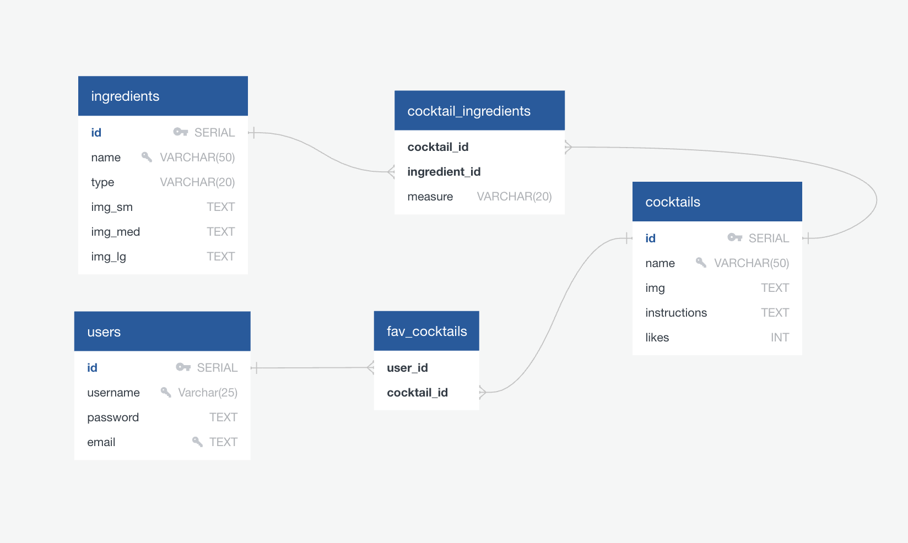

# Mixer DB

## Overview

Welcome to the Mixer DB Backend repository! 

Mixer DB is cocktail mixology application that contains a database with hundreds of cocktails and ingredients. This repository contains all of the files needed to create a fully functional database along with an API to easily find what you need.

## Technologies used

Node.js, Express.js, PostgreSQL

## How to Use
1. Clone this repository
2. **npm install** in the terminal to install the modules
3. **npm start** in the terminal to start the server

## Database Schema

Fairly simple stuff. One table each for cocktails and ingredients and a through table to match everything.

## Routes

1. Ingredients:
   - GET /ingredients --> get all ingredients from the db
   - GET /ingredients/id/:id --> get single ingredient by id
   - GET /ingredients/name/:name --> get single ingredient by name (exact match)
   - GET /ingredients/like/:name --> get multiple ingredients that partially match the name
   - GET /ingredients/type/:type --> get multiple ingredients by type
   - GET /ingredients/cocktails/:id --> get all cocktails that contain this ingredient by id (exact match)

2. Cocktails:
    - GET /cocktails --> get all cocktails from the db
    - GET /cocktails/id/:id --> get single cocktail by id (also displays ingredients)
    - GET /cocktails/name/:name --> get single cocktail by name (exact match. Also displays ingredients)
    - GET /cocktails/like/:name --> get multiple cocktails that partially match the name

## Credits

All cocktail and ingredient information was scraped from the **Cocktaildb** --> https://www.thecocktaildb.com/

Remember to drink responsibly and not go anywhere near this application unless you're at least 21 years of age.

